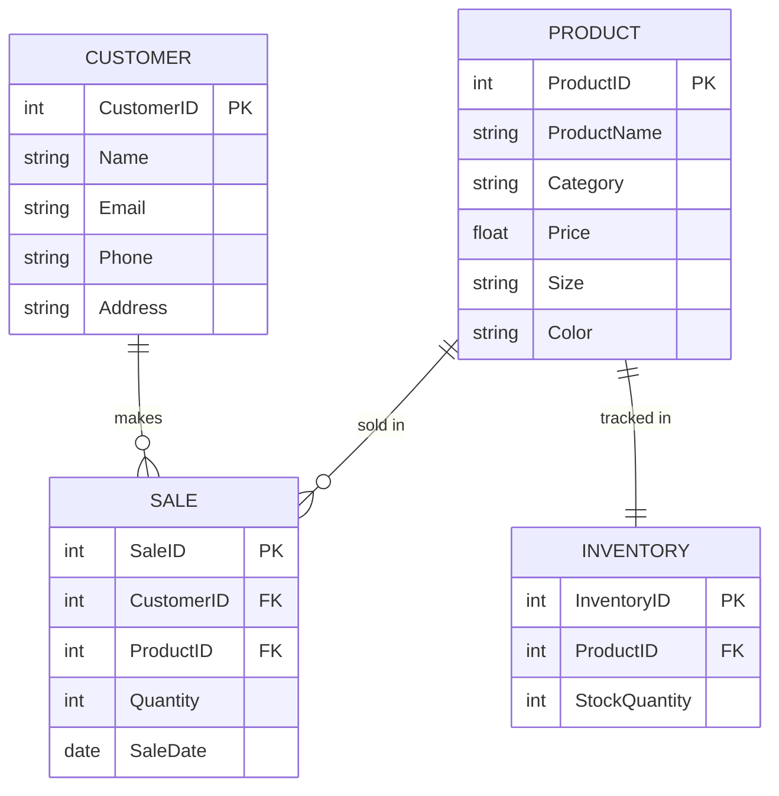

**Product**: Represents the Nike shoes available in the store, with details such as category, price, and size. This helps keep track of what is available for sale. 
**Customer**: Contains customer information to facilitate tracking of sales and customer preferences. 
**Sale**: Records each sales transaction, linking the product purchased with the customer. 
**Inventory**: Monitors stock levels for each product to ensure availability for customers and manage restocking.
